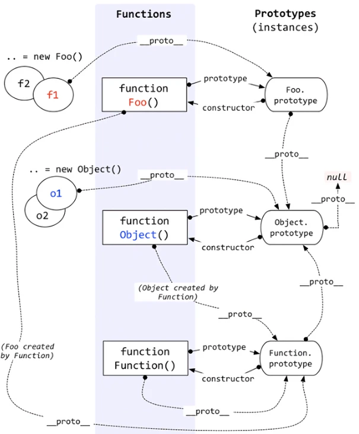

# 原型链图解

<!--  -->

- 一切对象都是继承自Object对象，Object 对象直接继承根源对象null
- 一切的函数对象（包括 Object 对象），都是继承自 Function 对象
- Object 对象直接继承自 Function 对象
- Function对象的__proto__会指向自己的原型对象，最终还是继承自Object对象

总结：所有从构造函数(自定义的构造函数也好,系统定义的Object,Array,Function也好)新创建出来的对象的--proto--一定指向这个构造函数的原型对象 而这个对象在向上那就是从 Object.prototype 出来的;如果再向上那就到了起源nulll 
