# 备份与还原

## 1.命令行方式

- 备份

  - 使用SecureCRT工具连接到Linux系统，输入：mysqldump -u root -p 数据库名称 > 文件保存路径

  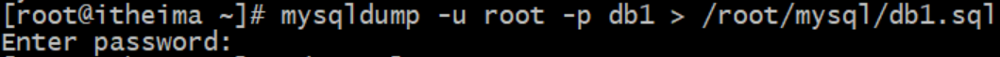

  - 进入文件保存路径，查看文件是否存在

  

  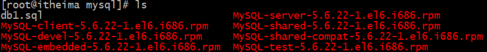

- 恢复

  - 登录mysql数据库

  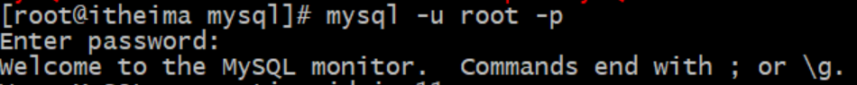

  - 删除已经备份的数据库

  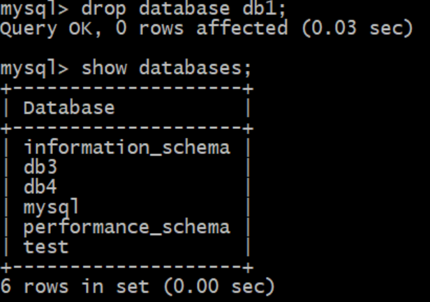

  - 重新创建名称相同的数据库

  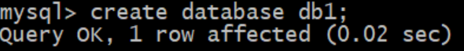

  - 使用该数据库

  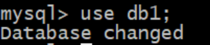

  - 导入文件执行：source 备份文件路径;

  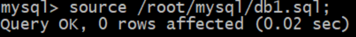

## 2.图形化界面方式

- 备份

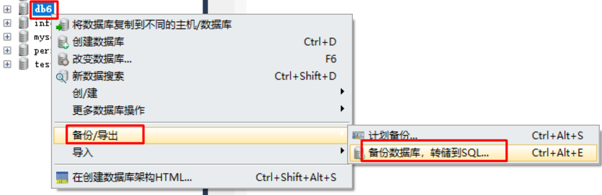

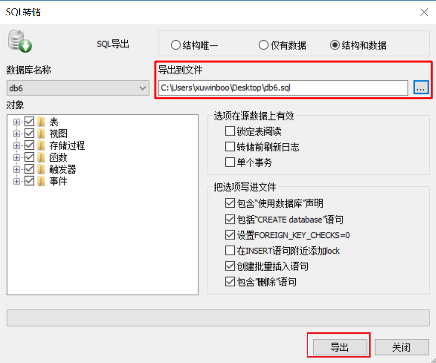

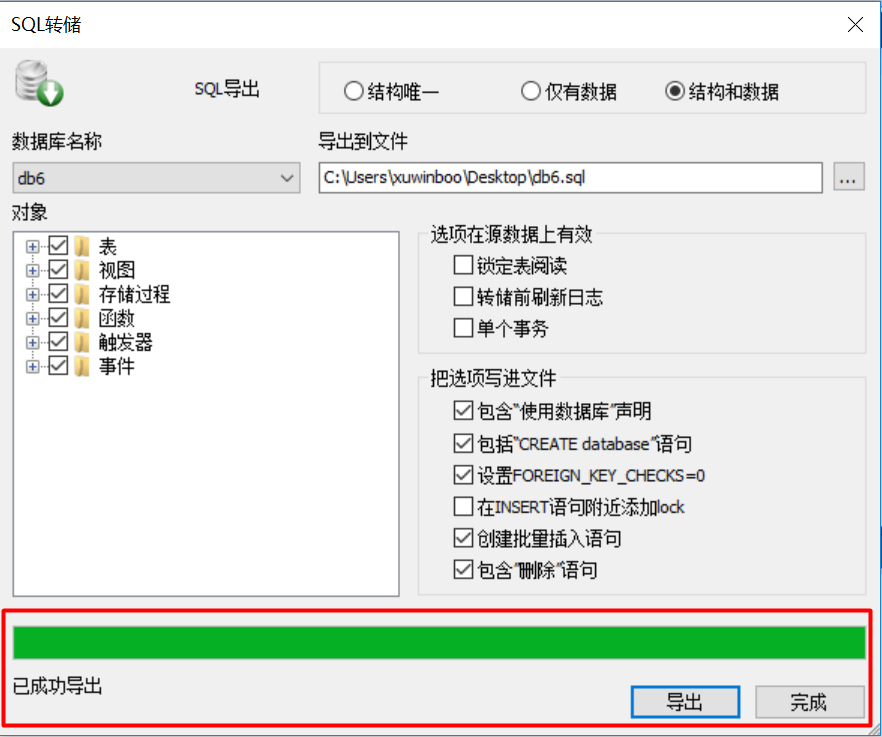

- 恢复

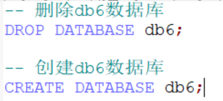

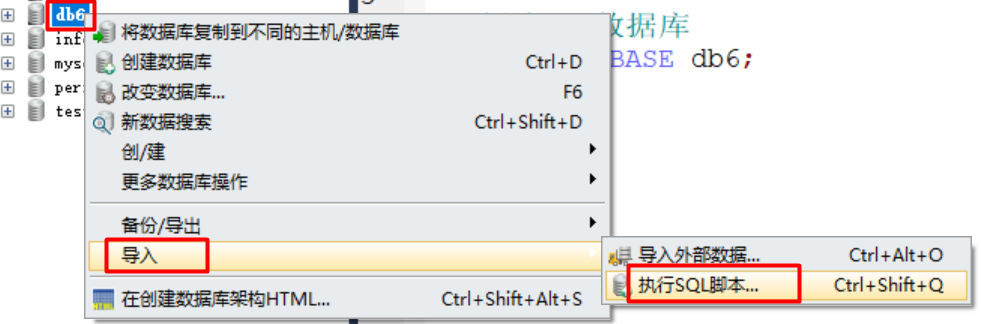

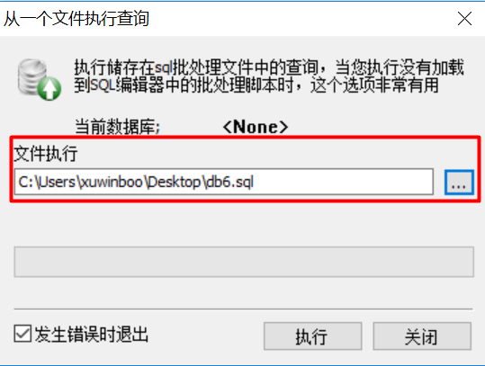

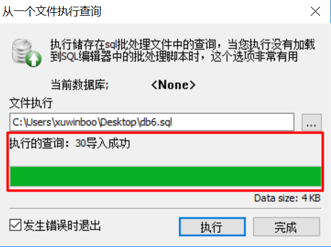

