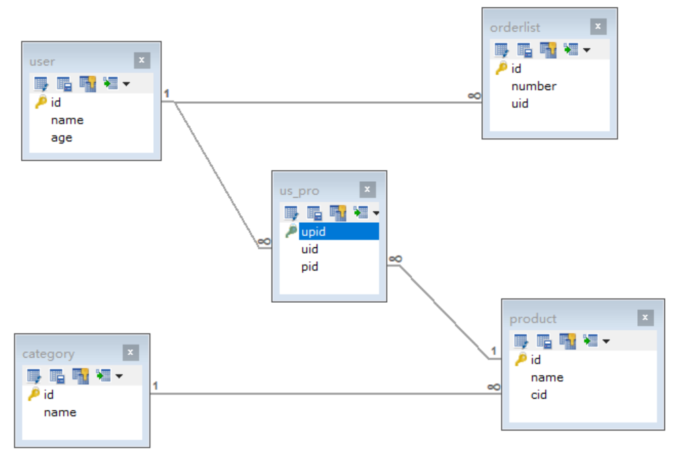

# 多表查询

## 1.多表查询-数据准备

- SQL语句

```sql
-- 创建db6数据库
CREATE DATABASE db6;
-- 使用db6数据库
USE db6;

-- 创建user表
CREATE TABLE USER(
	id INT PRIMARY KEY AUTO_INCREMENT,	-- 用户id
	NAME VARCHAR(20),			        -- 用户姓名
	age INT                             -- 用户年龄
);
-- 添加数据
INSERT INTO USER VALUES (1,'张三',23);
INSERT INTO USER VALUES (2,'李四',24);
INSERT INTO USER VALUES (3,'王五',25);
INSERT INTO USER VALUES (4,'赵六',26);


-- 订单表
CREATE TABLE orderlist(
	id INT PRIMARY KEY AUTO_INCREMENT,	-- 订单id
	number VARCHAR(30),					-- 订单编号
	uid INT,    -- 外键字段
	CONSTRAINT ou_fk1 FOREIGN KEY (uid) REFERENCES USER(id)
);
-- 添加数据
INSERT INTO orderlist VALUES (1,'hm001',1);
INSERT INTO orderlist VALUES (2,'hm002',1);
INSERT INTO orderlist VALUES (3,'hm003',2);
INSERT INTO orderlist VALUES (4,'hm004',2);
INSERT INTO orderlist VALUES (5,'hm005',3);
INSERT INTO orderlist VALUES (6,'hm006',3);
INSERT INTO orderlist VALUES (7,'hm007',NULL);


-- 商品分类表
CREATE TABLE category(
	id INT PRIMARY KEY AUTO_INCREMENT,  -- 商品分类id
	NAME VARCHAR(10)                    -- 商品分类名称
);
-- 添加数据
INSERT INTO category VALUES (1,'手机数码');
INSERT INTO category VALUES (2,'电脑办公');
INSERT INTO category VALUES (3,'烟酒茶糖');
INSERT INTO category VALUES (4,'鞋靴箱包');


-- 商品表
CREATE TABLE product(
	id INT PRIMARY KEY AUTO_INCREMENT,   -- 商品id
	NAME VARCHAR(30),                    -- 商品名称
	cid INT, -- 外键字段
	CONSTRAINT cp_fk1 FOREIGN KEY (cid) REFERENCES category(id)
);
-- 添加数据
INSERT INTO product VALUES (1,'华为手机',1);
INSERT INTO product VALUES (2,'小米手机',1);
INSERT INTO product VALUES (3,'联想电脑',2);
INSERT INTO product VALUES (4,'苹果电脑',2);
INSERT INTO product VALUES (5,'中华香烟',3);
INSERT INTO product VALUES (6,'玉溪香烟',3);
INSERT INTO product VALUES (7,'计生用品',NULL);


-- 中间表
CREATE TABLE us_pro(
	upid INT PRIMARY KEY AUTO_INCREMENT,  -- 中间表id
	uid INT, -- 外键字段。需要和用户表的主键产生关联
	pid INT, -- 外键字段。需要和商品表的主键产生关联
	CONSTRAINT up_fk1 FOREIGN KEY (uid) REFERENCES USER(id),
	CONSTRAINT up_fk2 FOREIGN KEY (pid) REFERENCES product(id)
);
-- 添加数据
INSERT INTO us_pro VALUES (NULL,1,1);
INSERT INTO us_pro VALUES (NULL,1,2);
INSERT INTO us_pro VALUES (NULL,1,3);
INSERT INTO us_pro VALUES (NULL,1,4);
INSERT INTO us_pro VALUES (NULL,1,5);
INSERT INTO us_pro VALUES (NULL,1,6);
INSERT INTO us_pro VALUES (NULL,1,7);
INSERT INTO us_pro VALUES (NULL,2,1);
INSERT INTO us_pro VALUES (NULL,2,2);
INSERT INTO us_pro VALUES (NULL,2,3);
INSERT INTO us_pro VALUES (NULL,2,4);
INSERT INTO us_pro VALUES (NULL,2,5);
INSERT INTO us_pro VALUES (NULL,2,6);
INSERT INTO us_pro VALUES (NULL,2,7);
INSERT INTO us_pro VALUES (NULL,3,1);
INSERT INTO us_pro VALUES (NULL,3,2);
INSERT INTO us_pro VALUES (NULL,3,3);
INSERT INTO us_pro VALUES (NULL,3,4);
INSERT INTO us_pro VALUES (NULL,3,5);
INSERT INTO us_pro VALUES (NULL,3,6);
INSERT INTO us_pro VALUES (NULL,3,7);
INSERT INTO us_pro VALUES (NULL,4,1);
INSERT INTO us_pro VALUES (NULL,4,2);
INSERT INTO us_pro VALUES (NULL,4,3);
INSERT INTO us_pro VALUES (NULL,4,4);
INSERT INTO us_pro VALUES (NULL,4,5);
INSERT INTO us_pro VALUES (NULL,4,6);
INSERT INTO us_pro VALUES (NULL,4,7);
```

- 架构器图解



## 2.多表查询-笛卡尔积查询(了解)

- 有两张表，获取这两个表的所有组合情况
- 要完成多表查询，需要消除这些没有用的数据
- 多表查询格式

```sql
SELECT
	列名列表
FROM
	表名列表
WHERE
	条件...
```

- 笛卡尔积查询

```sql
-- 标准语法
SELECT 列名 FROM 表名1,表名2,...;

-- 查询user表和orderlist表
SELECT * FROM USER,orderlist;
```

## 3.多表查询-内连接查询

- 查询原理
  - 内连接查询的是两张表有交集的部分数据(有主外键关联的数据)
- 显式内连接

```sql
-- 标准语法
SELECT 列名 FROM 表名1 [INNER] JOIN 表名2 ON 条件;

-- 查询用户信息和对应的订单信息
SELECT * FROM USER INNER JOIN orderlist ON user.id=orderlist.uid;
SELECT * FROM USER JOIN orderlist ON user.id=orderlist.uid;

-- 查询用户信息和对应的订单信息，起别名
SELECT * FROM USER u JOIN orderlist o ON u.id=o.uid;

-- 查询用户姓名，年龄。和订单编号
SELECT
	u.`name`,	-- 姓名
	u.`age`,	-- 年龄
	o.`number`	-- 订单编号
FROM
	USER u          -- 用户表
JOIN
	orderlist o     -- 订单表
ON 
	u.`id` = o.`uid`;
```

- 隐式内连接

```sql
-- 标准语法
SELECT 列名 FROM 表名1,表名2 WHERE 条件;

-- 查询用户姓名，年龄。和订单编号
SELECT
	u.`name`,	-- 姓名
	u.`age`,	-- 年龄
	o.`number`	-- 订单编号
FROM
	USER u,		-- 用户表
	orderlist o     -- 订单表
WHERE
	u.`id`=o.`uid`;
```

## 4.多表查询-外连接查询

- 左外连接

  - 查询原理
    - 查询左表的全部数据，和左右两张表有交集部分的数据
  - 基本演示

  ```sql
  -- 标准语法
  SELECT 列名 FROM 表名1 LEFT [OUTER] JOIN 表名2 ON 条件;
  
  -- 查询所有用户信息，以及用户对应的订单信息
  SELECT
  	u.`name`,	-- 姓名
  	u.`age`,	-- 年龄
  	o.`number`	-- 订单编号
  FROM
  	USER u          -- 用户表
  LEFT OUTER JOIN
  	orderlist o     -- 订单表
  ON
  	u.`id`=o.`uid`;
  ```

- 右外连接

  - 查询原理
    - 查询右表的全部数据，和左右两张表有交集部分的数据
  - 基本演示

  ```sql
  -- 基本语法
  SELECT 列名 FROM 表名1 RIGHT [OUTER] JOIN 表名2 ON 条件;
  
  -- 查询所有订单信息，以及订单所属的用户信息
  SELECT
  	u.`name`,	-- 姓名
  	u.`age`,	-- 年龄
  	o.`number`	-- 订单编号
  FROM
  	USER u          -- 用户表
  RIGHT OUTER JOIN
  	orderlist o     -- 订单表
  ON
  	u.`id`=o.`uid`;
  ```

## 5.多表查询-子查询

- 子查询介绍

  - 查询语句中嵌套了查询语句。我们就将嵌套查询称为子查询！

- 子查询-结果是单行单列的

  - 可以作为条件，使用运算符进行判断！
  - 基本演示

  ```sql
  -- 标准语法
  SELECT 列名 FROM 表名 WHERE 列名=(SELECT 聚合函数(列名) FROM 表名 [WHERE 条件]);
  
  -- 查询年龄最高的用户姓名
  SELECT MAX(age) FROM USER;              -- 查询出最高年龄
  SELECT NAME,age FROM USER WHERE age=26; -- 根据查询出来的最高年龄，查询姓名和年龄
  SELECT NAME,age FROM USER WHERE age = (SELECT MAX(age) FROM USER);
  ```

- 子查询-结果是多行单列的

  - 可以作为条件，使用运算符in或not in进行判断！
  - 基本演示

  ```sql
  -- 标准语法
  SELECT 列名 FROM 表名 WHERE 列名 [NOT] IN (SELECT 列名 FROM 表名 [WHERE 条件]); 
  
  -- 查询张三和李四的订单信息
  SELECT id FROM USER WHERE NAME='张三' OR NAME='李四';   -- 查询张三和李四用户的id
  SELECT number,uid FROM orderlist WHERE uid=1 OR uid=2; -- 根据id查询订单
  SELECT number,uid FROM orderlist WHERE uid IN (SELECT id FROM USER WHERE NAME='张三' OR NAME='李四');
  ```

- 子查询-结果是多行多列的

  - 可以作为一张虚拟表参与查询！
  - 基本演示

  ```sql
  -- 标准语法
  SELECT 列名 FROM 表名 [别名],(SELECT 列名 FROM 表名 [WHERE 条件]) [别名] [WHERE 条件];
  
  -- 查询订单表中id大于4的订单信息和所属用户信息
  SELECT * FROM USER u,(SELECT * FROM orderlist WHERE id>4) o WHERE u.id=o.uid;
  ```

## 6.多表查询练习

- 查询用户的编号、姓名、年龄。订单编号

```sql
/*
分析：
	用户的编号、姓名、年龄  user表     订单编号 orderlist表
	条件：user.id = orderlist.uid
*/
SELECT
	t1.`id`,	-- 用户编号
	t1.`name`,	-- 用户姓名
	t1.`age`,	-- 用户年龄
	t2.`number`	-- 订单编号
FROM
	USER t1,       -- 用户表
	orderlist t2   -- 订单表
WHERE
	t1.`id` = t2.`uid`;
```

- 查询所有的用户。用户的编号、姓名、年龄。订单编号

```sql
/*
分析：
	用户的编号、姓名、年龄 user表     订单编号 orderlist表
	条件：user.id = orderlist.uid
	查询所有用户，使用左外连接
*/
SELECT
	t1.`id`,	-- 用户编号
	t1.`name`,	-- 用户姓名
	t1.`age`,	-- 用户年龄
	t2.`number`	-- 订单编号
FROM
	USER t1        -- 用户表
LEFT OUTER JOIN
	orderlist t2   -- 订单表
ON
	t1.`id` = t2.`uid`;
```

- 查询所有的订单。用户的编号、姓名、年龄。订单编号

```sql
/*
分析：
	用户的编号、姓名、年龄 user表     订单编号 orderlist表
	条件：user.id = orderlist.uid
	查询所有订单，使用右外连接
*/
SELECT
	t1.`id`,	-- 用户编号
	t1.`name`,	-- 用户姓名
	t1.`age`,	-- 用户年龄
	t2.`number`	-- 订单编号
FROM
	USER t1         -- 用户表
RIGHT OUTER JOIN
	orderlist t2    -- 订单表
ON
	t1.`id` = t2.`uid`;
```

- 查询用户年龄大于23岁的信息。显示用户的编号、姓名、年龄。订单编号

```sql
/*
分析：
	用户的编号、姓名、年龄 user表     订单编号 orderlist表
	条件：user.age > 23 AND user.id = orderlist.uid
*/
/*
select
	t1.`id`,	-- 用户编号
	t1.`name`,	-- 用户姓名
	t1.`age`,	-- 用户年龄
	t2.`number`	-- 订单编号
from
	user t1,     -- 用户表
	orderlist t2 -- 订单表
where
	t1.`age` > 23
	and
	t1.`id` = t2.`uid`;
*/
SELECT
	t1.`id`,	-- 用户编号
	t1.`name`,	-- 用户姓名
	t1.`age`,	-- 用户年龄
	t2.`number`	-- 订单编号
FROM
	USER t1       -- 用户表
LEFT OUTER JOIN
	orderlist t2  -- 订单表
ON
	t1.`id` = t2.`uid`
WHERE
	t1.`age` > 23;
```

- 查询张三和李四用户的信息。显示用户的编号、姓名、年龄。订单编号

```sql
/*
分析：
	用户的编号、姓名、年龄 user表     订单编号 orderlist表
	条件：user.id = orderlist.uid AND user.name IN ('张三','李四');
*/
SELECT
	t1.`id`,	-- 用户编号
	t1.`name`,	-- 用户姓名
	t1.`age`,	-- 用户年龄
	t2.`number`	-- 订单编号
FROM
	USER t1,        -- 用户表
	orderlist t2    -- 订单表
WHERE
	t1.`id` = t2.`uid`
	AND
	-- (t1.`name` = '张三' OR t1.`name` = '李四');
	t1.`name` IN ('张三','李四');
```

- 查询商品分类的编号、分类名称。分类下的商品名称

```sql
/*
分析：
	商品分类的编号、分类名称 category表     分类下的商品名称 product表
	条件：category.id = product.cid
*/
SELECT
	t1.`id`,	-- 分类编号
	t1.`name`,	-- 分类名称
	t2.`name`	-- 商品名称
FROM
	category t1,	-- 商品分类表
	product t2	    -- 商品表
WHERE
	t1.`id` = t2.`cid`;
```

- 查询所有的商品分类。商品分类的编号、分类名称。分类下的商品名称

```sql
/*
分析：
	商品分类的编号、分类名称 category表     分类下的商品名称 product表
	条件：category.id = product.cid
	查询所有的商品分类，使用左外连接
*/
SELECT
	t1.`id`,	-- 分类编号
	t1.`name`,	-- 分类名称
	t2.`name`	-- 商品名称
FROM
	category t1	-- 商品分类表
LEFT OUTER JOIN
	product t2	-- 商品表
ON
	t1.`id` = t2.`cid`;
```

- 查询所有的商品信息。商品分类的编号、分类名称。分类下的商品名称

```sql
/*
分析：
	商品分类的编号、分类名称 category表     分类下的商品名称 product表
	条件：category.id = product.cid
	查询所有的商品信息，使用右外连接
*/
SELECT
	t1.`id`,	-- 分类编号
	t1.`name`,	-- 分类名称
	t2.`name`	-- 商品名称
FROM
	category t1	-- 商品分类表
RIGHT OUTER JOIN
	product t2	-- 商品表
ON
	t1.`id` = t2.`cid`;
```

- 查询所有的用户和所有的商品。显示用户的编号、姓名、年龄。商品名称

```sql
/*
分析：
	用户的编号、姓名、年龄 user表   商品名称 product表   中间表 us_pro
	条件：us_pro.uid = user.id AND us_pro.pid = product.id
*/
SELECT
	t1.`id`,	-- 用户编号
	t1.`name`,	-- 用户名称
	t1.`age`,	-- 用户年龄
	t2.`name`	-- 商品名称
FROM
	USER t1,	-- 用户表
	product t2,	-- 商品表
	us_pro t3	-- 中间表
WHERE
	t3.`uid` = t1.`id`
	AND
	t3.`pid` = t2.`id`;
```

- 查询张三和李四这两个用户可以看到的商品。显示用户的编号、姓名、年龄。商品名称

```sql
/*
分析：
	用户的编号、姓名、年龄 user表   商品名称 product表   中间表 us_pro
	条件：us_pro.uid = user.id AND us_pro.pid = product.id AND user.name IN ('张三','李四')
*/
SELECT
	t1.`id`,	-- 用户编号
	t1.`name`,	-- 用户名称
	t1.`age`,	-- 用户年龄
	t2.`name`	-- 商品名称
FROM
	USER t1,	-- 用户表
	product t2,	-- 商品表
	us_pro t3	-- 中间表
WHERE
	(t3.`uid` = t1.`id` AND t3.`pid` = t2.`id`)
	AND
	-- (t1.`name` = '张三' or t1.`name` = '李四');
	t1.`name` IN ('张三','李四');
```

## 7.多表查询-自关联查询

- 自关联查询介绍
  - 同一张表中有数据关联。可以多次查询这同一个表！
- 自关联查询演示

```sql
-- 创建员工表
CREATE TABLE employee(
	id INT PRIMARY KEY AUTO_INCREMENT,
	NAME VARCHAR(20),
	mgr INT,
	salary DOUBLE
);
-- 添加数据
INSERT INTO employee VALUES (1001,'孙悟空',1005,9000.00),
(1002,'猪八戒',1005,8000.00),
(1003,'沙和尚',1005,8500.00),
(1004,'小白龙',1005,7900.00),
(1005,'唐僧',NULL,15000.00),
(1006,'武松',1009,7600.00),
(1007,'李逵',1009,7400.00),
(1008,'林冲',1009,8100.00),
(1009,'宋江',NULL,16000.00);

-- 查询所有员工的姓名及其直接上级的姓名，没有上级的员工也需要查询
/*
分析：
	员工姓名 employee表        直接上级姓名 employee表
	条件：employee.mgr = employee.id
	查询左表的全部数据，和左右两张表交集部分数据，使用左外连接
*/
SELECT
	t1.name,	-- 员工姓名
	t1.mgr,		-- 上级编号
	t2.id,		-- 员工编号
	t2.name     -- 员工姓名
FROM
	employee t1  -- 员工表
LEFT OUTER JOIN
	employee t2  -- 员工表
ON
	t1.mgr = t2.id;
```
