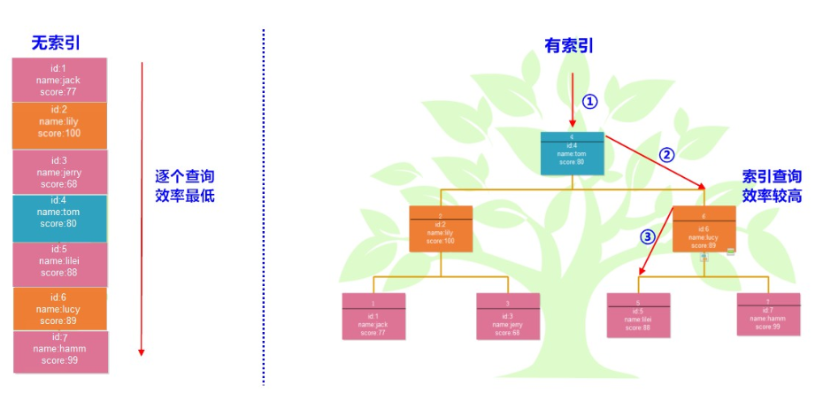
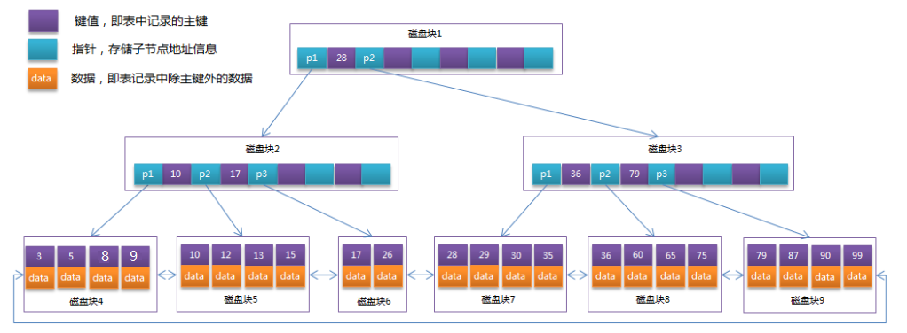

### MySQL索引

#### 1.索引的概念

- 我们之前学习过集合，其中的ArrayList集合的特点之一就是有索引。那么有索引会带来哪些好处呢？
- 没错，查询数据快！我们可以通过索引来快速查找到想要的数据。那么对于我们的MySQL数据库中的索引功能也是类似的！
- MySQL数据库中的索引：是帮助MySQL高效获取数据的一种数据结构！所以，索引的本质就是数据结构。
- 在表数据之外，数据库系统还维护着满足特定查找算法的数据结构，这些数据结构以某种方式指向数据， 这样就可以在这些数据结构上实现高级查找算法，这种数据结构就是索引。
- 一张数据表，用于保存数据。   一个索引配置文件，用于保存索引，每个索引都去指向了某一个数据(表格演示)
- 举例，无索引和有索引的查找原理



#### 2.索引的分类

- 功能分类 
  - 普通索引： 最基本的索引，它没有任何限制。
  - 唯一索引：索引列的值必须唯一，但允许有空值。如果是组合索引，则列值组合必须唯一。
  - 主键索引：一种特殊的唯一索引，不允许有空值。一般在建表时同时创建主键索引。
  - 组合索引：顾名思义，就是将单列索引进行组合。
  - 外键索引：只有InnoDB引擎支持外键索引，用来保证数据的一致性、完整性和实现级联操作。
  - 全文索引：快速匹配全部文档的方式。InnoDB引擎5.6版本后才支持全文索引。MEMORY引擎不支持。
- 结构分类
  - B+Tree索引 ：MySQL使用最频繁的一个索引数据结构，是InnoDB和MyISAM存储引擎默认的索引类型。
  - Hash索引 : MySQL中Memory存储引擎默认支持的索引类型。

#### 3.索引的操作

- 数据准备

```sql
-- 创建db12数据库
CREATE DATABASE db12;

-- 使用db12数据库
USE db12;

-- 创建student表
CREATE TABLE student(
	id INT PRIMARY KEY AUTO_INCREMENT,
	NAME VARCHAR(10),
	age INT,
	score INT
);
-- 添加数据
INSERT INTO student VALUES (NULL,'张三',23,98),(NULL,'李四',24,95),
(NULL,'王五',25,96),(NULL,'赵六',26,94),(NULL,'周七',27,99);
```

- 创建索引
  - 注意：如果一个表中有一列是主键，那么就会默认为其创建主键索引！(主键列不需要单独创建索引)

```sql
-- 标准语法
CREATE [UNIQUE|FULLTEXT] INDEX 索引名称
[USING 索引类型]  -- 默认是B+TREE
ON 表名(列名...);

-- 为student表中姓名列创建一个普通索引
CREATE INDEX idx_name ON student(NAME);

-- 为student表中年龄列创建一个唯一索引
CREATE UNIQUE INDEX idx_age ON student(age);
```

- 查看索引

```sql
-- 标准语法
SHOW INDEX FROM 表名;

-- 查看student表中的索引
SHOW INDEX FROM student;
```

- alter语句添加索引

```sql
-- 普通索引
ALTER TABLE 表名 ADD INDEX 索引名称(列名);

-- 组合索引
ALTER TABLE 表名 ADD INDEX 索引名称(列名1,列名2,...);

-- 主键索引
ALTER TABLE 表名 ADD PRIMARY KEY(主键列名); 

-- 外键索引(添加外键约束，就是外键索引)
ALTER TABLE 表名 ADD CONSTRAINT 外键名 FOREIGN KEY (本表外键列名) REFERENCES 主表名(主键列名);

-- 唯一索引
ALTER TABLE 表名 ADD UNIQUE 索引名称(列名);

-- 全文索引(mysql只支持文本类型)
ALTER TABLE 表名 ADD FULLTEXT 索引名称(列名);

-- 为student表中name列添加全文索引
ALTER TABLE student ADD FULLTEXT idx_fulltext_name(name);

-- 查看student表中的索引
SHOW INDEX FROM student;
```

- 删除索引

```sql
-- 标准语法
DROP INDEX 索引名称 ON 表名;

-- 删除student表中的idx_score索引
DROP INDEX idx_score ON student;

-- 查看student表中的索引
SHOW INDEX FROM student;
```

#### 4.索引效率的测试

```sql
-- 创建product商品表
CREATE TABLE product(
	id INT PRIMARY KEY AUTO_INCREMENT,  -- 商品id
	NAME VARCHAR(10),		    -- 商品名称
	price INT                           -- 商品价格
);

-- 定义存储函数，生成长度为10的随机字符串并返回
DELIMITER $

CREATE FUNCTION rand_string() 
RETURNS VARCHAR(255)
BEGIN
	DECLARE big_str VARCHAR(100) DEFAULT 'abcdefghijklmnopqrstuvwxyzABCDEFGHIGKLMNOPQRSTUVWXYZ';
	DECLARE small_str VARCHAR(255) DEFAULT '';
	DECLARE i INT DEFAULT 1;
	
	WHILE i <= 10 DO
		SET small_str =CONCAT(small_str,SUBSTRING(big_str,FLOOR(1+RAND()*52),1));
		SET i=i+1;
	END WHILE;
	
	RETURN small_str;
END$

DELIMITER ;


-- 定义存储过程，添加100万条数据到product表中
DELIMITER $

CREATE PROCEDURE pro_test()
BEGIN
	DECLARE num INT DEFAULT 1;
	
	WHILE num <= 1000000 DO
		INSERT INTO product VALUES (NULL,rand_string(),num);
		SET num = num + 1;
	END WHILE;
END$

DELIMITER ;

-- 调用存储过程
CALL pro_test();


-- 查询总记录条数
SELECT COUNT(*) FROM product;


-- 查询product表的索引
SHOW INDEX FROM product;

-- 查询name为OkIKDLVwtG的数据   (0.049)
SELECT * FROM product WHERE NAME='OkIKDLVwtG';

-- 通过id列查询OkIKDLVwtG的数据  (1毫秒)
SELECT * FROM product WHERE id=999998;

-- 为name列添加索引
ALTER TABLE product ADD INDEX idx_name(NAME);

-- 查询name为OkIKDLVwtG的数据   (0.001)
SELECT * FROM product WHERE NAME='OkIKDLVwtG';


/*
	范围查询
*/
-- 查询价格为800~1000之间的所有数据 (0.052)
SELECT * FROM product WHERE price BETWEEN 800 AND 1000;

/*
	排序查询
*/
-- 查询价格为800~1000之间的所有数据,降序排列  (0.083)
SELECT * FROM product WHERE price BETWEEN 800 AND 1000 ORDER BY price DESC;

-- 为price列添加索引
ALTER TABLE product ADD INDEX idx_price(price);

-- 查询价格为800~1000之间的所有数据 (0.011)
SELECT * FROM product WHERE price BETWEEN 800 AND 1000;

-- 查询价格为800~1000之间的所有数据,降序排列  (0.001)
SELECT * FROM product WHERE price BETWEEN 800 AND 1000 ORDER BY price DESC;
```

#### 5.索引的实现原则

- 索引是在MySQL的存储引擎中实现的，所以每种存储引擎的索引不一定完全相同，也不是所有的引擎支持所有的索引类型。这里我们主要介绍InnoDB引擎的实现的**B+Tree索引**。
- B+Tree是一种树型数据结构，是B-Tree的变种。通常使用在数据库和操作系统中的文件系统，特点是能够保持数据稳定有序。我们逐步的来了解一下。

##### 5.1磁盘存储

- 系统从磁盘读取数据到内存时是以磁盘块（block）为基本单位的
- 位于同一个磁盘块中的数据会被一次性读取出来，而不是需要什么取什么。
- InnoDB存储引擎中有页（Page）的概念，页是其磁盘管理的最小单位。InnoDB存储引擎中默认每个页的大小为16KB。
- InnoDB引擎将若干个地址连接磁盘块，以此来达到页的大小16KB，在查询数据时如果一个页中的每条数据都能有助于定位数据记录的位置，这将会减少磁盘I/O次数，提高查询效率。

##### 5.2BTree

- BTree结构的数据可以让系统高效的找到数据所在的磁盘块。为了描述BTree，首先定义一条记录为一个二元组[key, data] ，key为记录的键值，对应表中的主键值，data为一行记录中除主键外的数据。对于不同的记录，key值互不相同。BTree中的每个节点根据实际情况可以包含大量的关键字信息和分支，如下图所示为一个3阶的BTree： 

  

- 根据图中结构显示，每个节点占用一个盘块的磁盘空间，一个节点上有两个升序排序的关键字和三个指向子树根节点的指针，指针存储的是子节点所在磁盘块的地址。两个关键词划分成的三个范围域对应三个指针指向的子树的数据的范围域。以根节点为例，关键字为17和35，P1指针指向的子树的数据范围为小于17，P2指针指向的子树的数据范围为17~35，P3指针指向的子树的数据范围为大于35。

查找顺序：

```sql
模拟查找15的过程 : 

1.根节点找到磁盘块1，读入内存。【磁盘I/O操作第1次】
	比较关键字15在区间（<17），找到磁盘块1的指针P1。
2.P1指针找到磁盘块2，读入内存。【磁盘I/O操作第2次】
	比较关键字15在区间（>12），找到磁盘块2的指针P3。
3.P3指针找到磁盘块7，读入内存。【磁盘I/O操作第3次】
	在磁盘块7中找到关键字15。
	
-- 分析上面过程，发现需要3次磁盘I/O操作，和3次内存查找操作。
-- 由于内存中的关键字是一个有序表结构，可以利用二分法查找提高效率。而3次磁盘I/O操作是影响整个BTree查找效率的决定因素。BTree使用较少的节点个数，使每次磁盘I/O取到内存的数据都发挥了作用，从而提高了查询效率。
```

##### 5.3B+Tree

- B+Tree是在BTree基础上的一种优化，使其更适合实现外存储索引结构，InnoDB存储引擎就是用B+Tree实现其索引结构。
- 从上一节中的BTree结构图中可以看到每个节点中不仅包含数据的key值，还有data值。而每一个页的存储空间是有限的，如果data数据较大时将会导致每个节点（即一个页）能存储的key的数量很小，当存储的数据量很大时同样会导致B-Tree的深度较大，增大查询时的磁盘I/O次数，进而影响查询效率。在B+Tree中，所有数据记录节点都是按照键值大小顺序存放在同一层的叶子节点上，而非叶子节点上只存储key值信息，这样可以大大加大每个节点存储的key值数量，降低B+Tree的高度。
- B+Tree相对于BTree区别：
  - 非叶子节点只存储键值信息。
  - 所有叶子节点之间都有一个连接指针。
  - 数据记录都存放在叶子节点中。
- 将上一节中的BTree优化，由于B+Tree的非叶子节点只存储键值信息，假设每个磁盘块能存储4个键值及指针信息，则变成B+Tree后其结构如下图所示：



通常在B+Tree上有两个头指针，一个指向根节点，另一个指向关键字最小的叶子节点，而且所有叶子节点（即数据节点）之间是一种链式环结构。因此可以对B+Tree进行两种查找运算：

- 【有范围】对于主键的范围查找和分页查找
- 【有顺序】从根节点开始，进行随机查找

实际情况中每个节点可能不能填充满，因此在数据库中，B+Tree的高度一般都在2~4层。MySQL的InnoDB存储引擎在设计时是将根节点常驻内存的，也就是说查找某一键值的行记录时最多只需要1~3次磁盘I/O操作。

#### 6.总结：索引的设计原则

索引的设计可以遵循一些已有的原则，创建索引的时候请尽量考虑符合这些原则，便于提升索引的使用效率，更高效的使用索引。

- 创建索引时的原则
  - 对查询频次较高，且数据量比较大的表建立索引。
  - 使用唯一索引，区分度越高，使用索引的效率越高。
  - 索引字段的选择，最佳候选列应当从where子句的条件中提取，如果where子句中的组合比较多，那么应当挑选最常用、过滤效果最好的列的组合。
  - 使用短索引，索引创建之后也是使用硬盘来存储的，因此提升索引访问的I/O效率，也可以提升总体的访问效率。假如构成索引的字段总长度比较短，那么在给定大小的存储块内可以存储更多的索引值，相应的可以有效的提升MySQL访问索引的I/O效率。
  - 索引可以有效的提升查询数据的效率，但索引数量不是多多益善，索引越多，维护索引的代价自然也就水涨船高。对于插入、更新、删除等DML操作比较频繁的表来说，索引过多，会引入相当高的维护代价，降低DML操作的效率，增加相应操作的时间消耗。另外索引过多的话，MySQL也会犯选择困难病，虽然最终仍然会找到一个可用的索引，但无疑提高了选择的代价。
- 联合索引的特点

在mysql建立联合索引时会遵循最左前缀匹配的原则，即最左优先，在检索数据时从联合索引的最左边开始匹配，
对列name列、address和列phone列建一个联合索引

```sql
ALTER TABLE user ADD INDEX index_three(name,address,phone);
```

联合索引index_three实际建立了(name)、(name,address)、(name,address,phone)三个索引。所以下面的三个SQL语句都可以命中索引。

```sql
SELECT * FROM user WHERE address = '北京' AND phone = '12345' AND name = '张三';
SELECT * FROM user WHERE name = '张三' AND address = '北京';
SELECT * FROM user WHERE name = '张三';
```

上面三个查询语句执行时会依照最左前缀匹配原则，检索时分别会使用索引进行数据匹配。

```
(name,address,phone)
(name,address)
(name)
```

索引的字段可以是任意顺序的，如：

```sql
-- 优化器会帮助我们调整顺序，下面的SQL语句都可以命中索引
SELECT * FROM user WHERE address = '北京' AND phone = '12345' AND name = '张三';
```

Mysql的优化器会帮助我们调整where条件中的顺序，以匹配我们建立的索引。

联合索引中最左边的列不包含在条件查询中，所以根据上面的原则，下面的SQL语句就不会命中索引。

```sql
-- 联合索引中最左边的列不包含在条件查询中，下面的SQL语句就不会命中索引
SELECT * FROM user WHERE address = '北京' AND phone = '12345';
```

### 