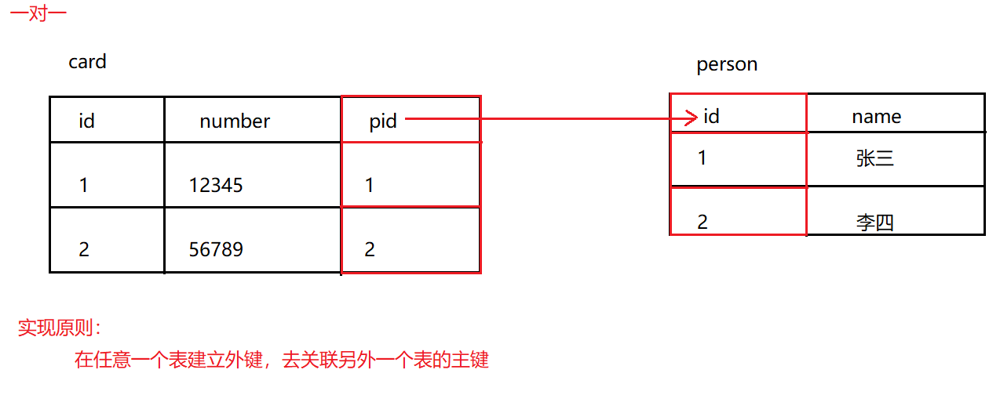
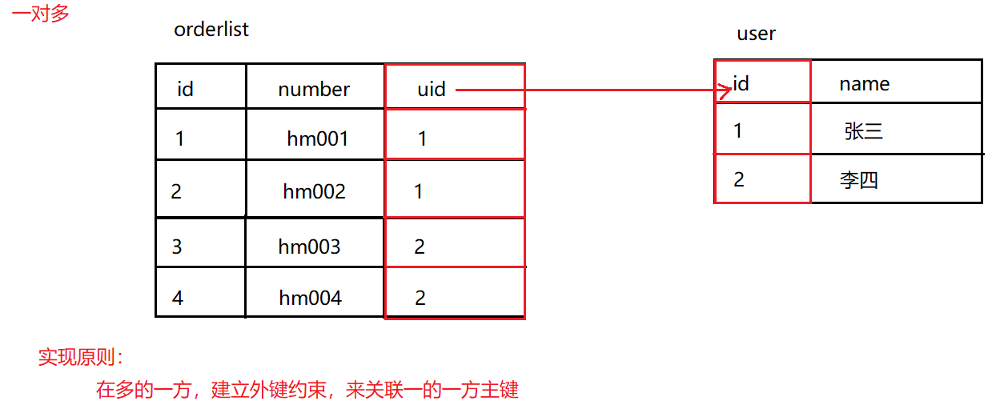

# 表设计

## 1.一对一(了解)

- 分析
  - 人和身份证。一个人只有一个身份证，一个身份证只能对应一个人！
- 实现原则
  - 在任意一个表建立外键，去关联另外一个表的主键
- SQL演示

```sql
-- 创建db5数据库
CREATE DATABASE db5;
-- 使用db5数据库
USE db5;

-- 创建person表
CREATE TABLE person(
	id INT PRIMARY KEY AUTO_INCREMENT,
	NAME VARCHAR(20)
);
-- 添加数据
INSERT INTO person VALUES (NULL,'张三'),(NULL,'李四');

-- 创建card表
CREATE TABLE card(
	id INT PRIMARY KEY AUTO_INCREMENT,
	number VARCHAR(50),
	pid INT UNIQUE,
	CONSTRAINT cp_fk1 FOREIGN KEY (pid) REFERENCES person(id) -- 添加外键
);
-- 添加数据
INSERT INTO card VALUES (NULL,'12345',1),(NULL,'56789',2);
```

- 图解



## 2.一对多

- 分析
  - 用户和订单。一个用户可以有多个订单！
  - 商品分类和商品。一个分类下可以有多个商品！
- 实现原则
  - 在多的一方，建立外键约束，来关联一的一方主键
- SQL演示

```sql
/*
	用户和订单
*/
-- 创建user表
CREATE TABLE USER(
	id INT PRIMARY KEY AUTO_INCREMENT,
	NAME VARCHAR(20)
);
-- 添加数据
INSERT INTO USER VALUES (NULL,'张三'),(NULL,'李四');

-- 创建orderlist表
CREATE TABLE orderlist(
	id INT PRIMARY KEY AUTO_INCREMENT,
	number VARCHAR(20),
	uid INT,
	CONSTRAINT ou_fk1 FOREIGN KEY (uid) REFERENCES USER(id)  -- 添加外键约束
);
-- 添加数据
INSERT INTO orderlist VALUES (NULL,'hm001',1),(NULL,'hm002',1),(NULL,'hm003',2),(NULL,'hm004',2);


/*
	商品分类和商品
*/
-- 创建category表
CREATE TABLE category(
	id INT PRIMARY KEY AUTO_INCREMENT,
	NAME VARCHAR(10)
);
-- 添加数据
INSERT INTO category VALUES (NULL,'手机数码'),(NULL,'电脑办公');

-- 创建product表
CREATE TABLE product(
	id INT PRIMARY KEY AUTO_INCREMENT,
	NAME VARCHAR(30),
	cid INT,
	CONSTRAINT pc_fk1 FOREIGN KEY (cid) REFERENCES category(id)  -- 添加外键约束
);
-- 添加数据
INSERT INTO product VALUES (NULL,'华为P30',1),(NULL,'小米note3',1),
(NULL,'联想电脑',2),(NULL,'苹果电脑',2);
```

- 图解



## 3.多对多

- 分析
  - 学生和课程。一个学生可以选择多个课程，一个课程也可以被多个学生选择！
- 实现原则
  - 需要借助第三张表中间表，中间表至少包含两个列，这两个列作为中间表的外键，分别关联两张表的主键
- SQL演示

```sql
-- 创建student表
CREATE TABLE student(
	id INT PRIMARY KEY AUTO_INCREMENT,
	NAME VARCHAR(20)
);
-- 添加数据
INSERT INTO student VALUES (NULL,'张三'),(NULL,'李四');

-- 创建course表
CREATE TABLE course(
	id INT PRIMARY KEY AUTO_INCREMENT,
	NAME VARCHAR(10)
);
-- 添加数据
INSERT INTO course VALUES (NULL,'语文'),(NULL,'数学');

-- 创建中间表
CREATE TABLE stu_course(
	id INT PRIMARY KEY AUTO_INCREMENT,
	sid INT, -- 用于和student表的id进行外键关联
	cid INT, -- 用于和course表的id进行外键关联
	CONSTRAINT sc_fk1 FOREIGN KEY (sid) REFERENCES student(id), -- 添加外键约束
	CONSTRAINT sc_fk2 FOREIGN KEY (cid) REFERENCES course(id)   -- 添加外键约束
);
-- 添加数据
INSERT INTO stu_course VALUES (NULL,1,1),(NULL,1,2),(NULL,2,1),(NULL,2,2);
```

- 图解


