# 集群

#### 1.集群的概念

- 如今随着互联网的发展，数据的量级也是成指数的增长，从GB到TB到PB。对数据的各种操作也是愈加的困难，传统的关系型数据库已经无法满足快速查询与插入数据的需求。一台数据库服务器已经无法满足海量数据的存储需求，所以由多台数据库构成的数据库集群成了必然的方式。不过，为了保证数据的一致性，查询效率等，同时又要解决多台服务器间的通信、负载均衡等问题。
- MyCat是一款数据库集群软件，是阿里曾经开源的知名产品——Cobar，简单的说，MyCAT就是：一个新颖的数据库中间件产品支持MySQL集群，提供高可用性数据分片集群。你可以像使用mysql一样使用mycat。对于开发人员来说根本感觉不到mycat的存在。MyCat不单单是支持MySQL，像常用的关系型数据库Oracle、SqlServer都支持。


#### 2.集群的原理

- 我们来说个例子，大海捞针和一个水瓶里捞针，毋庸置疑水瓶里一定能更快找到针，因为它需要检索的范围更小。数据库集群也是如此原理，我们可以将一个数据量为300G的数据库数据平均拆分成3部分，每个数据库中只存储100G数据，此时用户搜索，先经过我们中间代理层，中间代理层同时发出3个请求执行查询，比如第1台返回100条数据，耗时3秒，第2台返回200条数据，耗时3秒，第3台返回500条数据，耗时3秒，此时中间件只需要在800条记录中进行筛选，即可检索出用户要的结果，此时耗时其实一共只有3秒，因为每台机器做运算的时候，都是同时执行。如果我们此时直接在300G的数据库查询，耗时10秒，那使用中间件进行集群的效率就非常明显


- MyCat的实现流程和这个流程大致相似。MyCat自身不存储数据，但用户每次链接数据库的时候，直接连接MyCat即可.所以我们MyCat自身其实就是个逻辑数据库，它自身还有表结构，表结构叫逻辑表。

#### 3.Mycat环境搭建

##### 3.1 Mycat下载和安装

- 官网：`http://www.mycat.io/`

  

- 下载地址 : `http://dl.mycat.io/`

  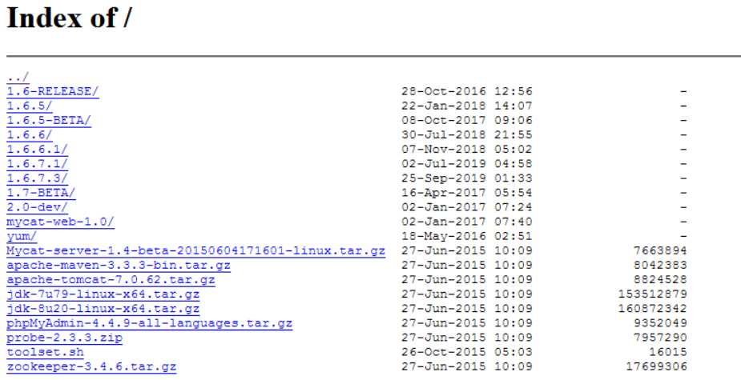

- 选择1.6.7.1的版本，下载到D盘，安装包入下图：

  

- 上传：使用SecureCRT的SFTP命令，将文件发送到Linux虚拟机root目录下：

  ```java
  sftp> put D:\Mycat-server-1.6.7.1-release-20190627191042-linux.tar.gz 
  ```

- 解压：解压mycat.tar.gz并查看

  ```java
  tar -zxvf mycat.tar.gz
  cd mycat
  ll
  ```

  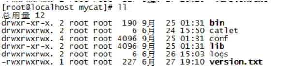

- 授权：设置mycat权限

  ```java
  chmod -R 777 mycat
  ```

- 环境变量：配置环境变量

  ```java
  vi /etc/profile 
  // 添加
  export MYCAT_HOME=/root/mycat
  
  // 使环境变量生效
  source /etc/profile
  ```

- 启动mycat

  ```java
  // 进入bin目录
  [root@localhost]# cd /root/mycat/bin
  
  // 执行启动命令
  [root@localhost bin]# ./mycat start
  ```

- 查看：检测端口监听状况，Mycat的端口号是8066

  ```java
  [root@localhost bin]# netstat -ant|grep 8066
  ```

  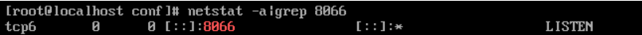

- 连接：使用SQLYog连接Mycat

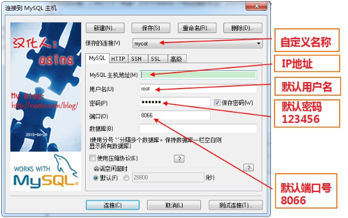

- 连接后显示：

  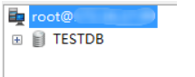

##### 3.2 环境准备

- 配置模型

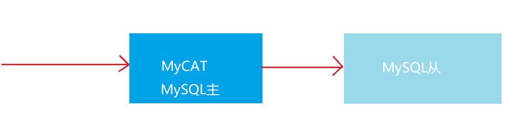

- 克隆虚拟机


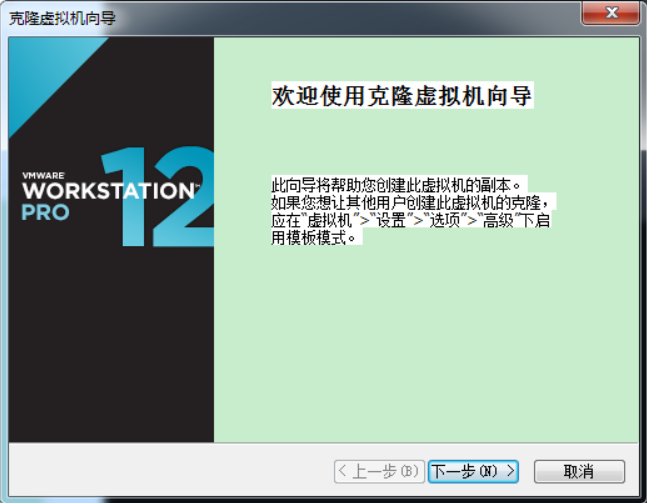

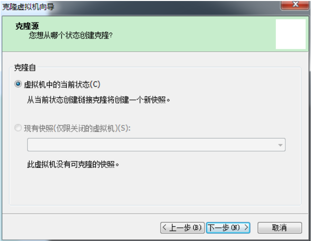


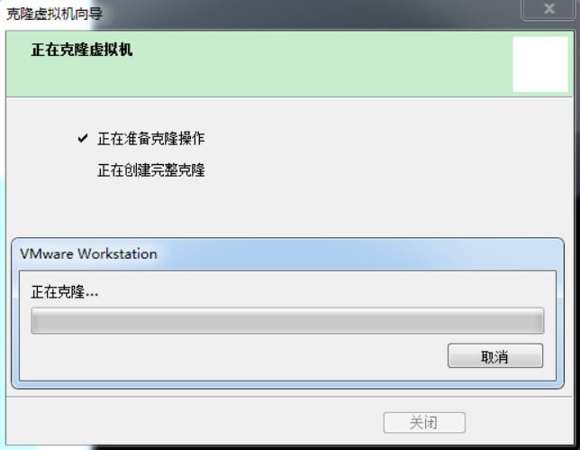


- 修改配置网卡

  - 在第二个虚拟机中，生成全新mac地址

  

  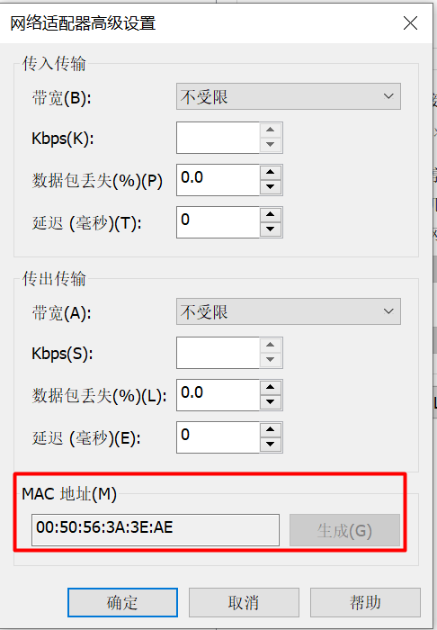

  - 重启网络

  ```shell
  // 重启网络
  service network restart
  //查看ip地址
  ip addr
  ```

- 修改mysql配置文件,更改uuid

  - 在第二个服务器上，修改mysql的uuid

  ```
  // 编辑配置文件
  vi /var/lib/mysql/auto.cnf
  // 将server-uuid更改
  ```

- 启动MySQL并查看

```
//将两台服务器的防火墙关闭
systemctl stop firewalld

//启动两台服务器的mysql
service mysqld restart

//启动两台服务器的mycat
cd /root/mycat/bin
./mycat restart

//查看监听端口
netstat -ant|grep 3306
netstat -ant|grep 8066

//使用sqlyog测试连接
```

#### 4.主从复制

- 主从复制的概念

  - 为了使用Mycat进行读写分离，我们先要配置MySQL数据库的主从复制。
  - 从服务器自动同步主服务器的数据，从而达到数据一致。
  - 进而，我们可以写操作时，只操作主服务器，而读操作，就可以操作从服务器了。
  - 原理：主服务器在处理数据时，生成binlog日志，通过对日志的备份，实现从服务器的数据同步。

  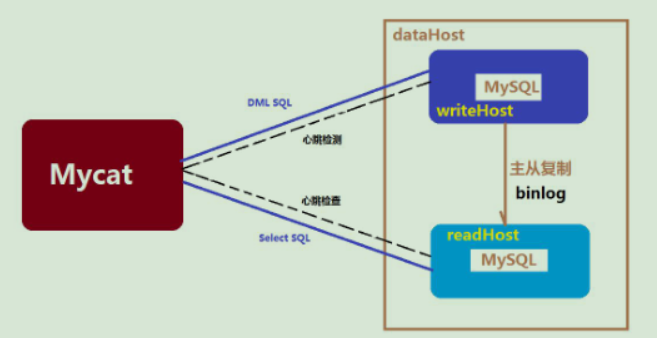

- 主服务器的配置

  - 在第一个服务器上，编辑mysql配置文件

  ```
  // 编辑mysql配置文件
  vi /etc/my.cnf
  
  //在[mysqld]下面加上：
  log-bin=mysql-bin # 开启复制操作
  server-id=1 # master is 1
  innodb_flush_log_at_trx_commit=1
  sync_binlog=1
  ```

  - 登录mysql，创建用户并授权

  ```
  // 登录mysql
  mysql -u root -p
  
  // 去除密码权限
  SET GLOBAL validate_password_policy=0;
  SET GLOBAL validate_password_length=1;
  
  // 创建用户
  CREATE USER 'hm'@'%' IDENTIFIED BY 'itheima';
  
  // 授权
  GRANT ALL ON *.* TO 'hm'@'%';
  ```

  - 重启mysql服务，登录mysql服务

  ```
  // 重启mysql
  service mysqld restart
  
  // 登录mysql
  mysql -u root -p
  ```

  - 查看主服务器的配置

  ```
  // 查看主服务器配置
  show master status;
  ```

  

- 从服务器的配置

  - 在第二个服务器上，编辑mysql配置文件

  ```
  // 编辑mysql配置文件
  vi /etc/my.cnf
  
  // 在[mysqld]下面加上：
  server-id=2
  ```

  - 登录mysql

  ```
  // 登录mysql
  mysql -u root -p
  
  // 执行
  use mysql;
  drop table slave_master_info;
  drop table slave_relay_log_info;
  drop table slave_worker_info;
  drop table innodb_index_stats;
  drop table innodb_table_stats;
  source /usr/share/mysql/mysql_system_tables.sql;
  ```

  - 重启mysql，重新登录，配置从节点

  ```
  // 重启mysql
  service mysqld restart
  
  // 重新登录mysql
  mysql -u root -p
  
  // 执行
  change master to master_host='主服务器ip地址',master_port=3306,master_user='hm',master_password='itheima',master_log_file='mysql-bin.000001',master_log_pos=4642;
  ```

  - 重启mysql，重新登录，开启从节点

  ```
  // 重启mysql
  service mysqld restart
  
  // 重新登录mysql
  mysql -u root -p
  
  // 开启从节点
  start slave;
  
  // 查询结果
  show slave status\G;
  //Slave_IO_Running和Slave_SQL_Running都为yes才表示同步成功。
  ```

  

- 测试

  - sqlyog连接主服务器

  ```sql
  -- 主服务器创建db1数据库,从服务器会自动同步
  CREATE DATABASE db1;
  ```

  - sqlyog连接从服务器

  ```sql
  -- 从服务器创建db2数据库,主服务器不会自动同步
  CREATE DATABASE db2;
  ```

- 启动失败的解决方案

```
启动失败：Slave_IO_Running为 NO 
方法一:重置slave
slave stop;
reset slave;
start slave ;
方法二:重设同步日志文件及读取位置
slave stop;
change master to master_log_file=’mysql-bin.000001’, master_log_pos=1;
start slave ;
```

#### 5.读写分离

- 读写分离的概念
  - 写操作只写入主服务器，读操作读取从服务器。

- 在主服务器上修改server.xml
  - user标签主要用于定义登录mycat的用户和权限。如上面定义用户名mycat和密码123456，该用户可以访问的schema的HEIMADB逻辑库。

```xml
<user name="root" defaultAccount="true">
		<property name="password">123456</property>
		<property name="schemas">HEIMADB</property>
		
		<!-- 表级 DML 权限设置 -->
		<!-- 		
		<privileges check="false">
			<schema name="TESTDB" dml="0110" >
				<table name="tb01" dml="0000"></table>
				<table name="tb02" dml="1111"></table>
			</schema>
		</privileges>		
		 -->
</user>
```

- 在主服务器上修改schema.xml

```xml
<?xml version="1.0"?>
<!DOCTYPE mycat:schema SYSTEM "schema.dtd">
<mycat:schema xmlns:mycat="http://io.mycat/">

	<schema name="HEIMADB" checkSQLschema="false" sqlMaxLimit="100" dataNode="dn1"></schema>
	
	<dataNode name="dn1" dataHost="localhost1" database="db1" />
	
	<dataHost name="localhost1" maxCon="1000" minCon="10" balance="1"
			  writeType="0" dbType="mysql" dbDriver="native" switchType="1"  slaveThreshold="100">
		<heartbeat>select user()</heartbeat>
		<!-- 主服务器进行写操作 -->
		<writeHost host="hostM1" url="localhost:3306" user="root"
				   password="itheima">
		<!-- 从服务器负责读操作 -->
		<readHost host="hostS1" url="192.168.203.135:3306" user="root" password="itheima" />
		</writeHost>
	</dataHost>
	
</mycat:schema>
```

- 配置详解

  - schema标签逻辑库的概念和mysql数据库中Datebase的概念相同，我们在查询这两个逻辑库中的表的时候，需要切换到该逻辑库下才可以查到所需要的表。
  - dataNode属性：该属性用于绑定逻辑库到某个具体的database上。
  - dataNode标签： dataNode标签定义了mycat中的数据节点，也就是数据分片。一个dataNode标签就是一个独立的数据分片。
  - name属性：定义数据节点的名字，这个名字需要是唯一的，我们需要在table标签上应用这个名字，来建立表与分片对应的关系。
  - dataHost属性：该属性用于定义该分片属于那个数据库实例，属性值是引用datahost标签定义的name属性。
  - database属性：该属性用于定义该分片属于那个具体数据库实例上的具体库，因为这里使用两个纬度来定义分片，就是：实例+具体的库。因为每个库上建立的表和表结构是一样的。所以这样做就可以轻松的对表进行水平拆分。
  - dataHost标签：该标签在mycat逻辑库中也是作为最底层的标签存在，直接定义了具体的数据库实例、读写分离配置和心跳语句。

  - balance属性： 负载均衡类型
    ​    balance=0: 不开启读写分离，所有读操作都发送到当前可用的writeHost上。
    ​    balance=1: 全部的readHost与Stand by writeHost都参与select语句的负载均衡
    ​     balance=2: 所有的读操作都随机在writeHost，readHost上分发。
    ​     balance=3: 所有的读请求都随机分配到writeHost对应的readHost上执行，writeHost不负担读压力。
  - switchType属性： 
    ​    -1：表示不自动切换。
    ​    1  ：默认值，表示自动切换
    ​    2：表示基于MySQL主从同步状态决定是否切换，心跳语句： show slave status.
    ​    3:表示基于mysql galary cluster的切换机制，适合mycat1.4之上的版本，心跳语句show status like "%esrep%";
  - writeHost标签，readHost标签：这两个标签指定后端数据库的相关配置给mycat，用于实例化后端连接池。唯一不同的是，writeHost指定写实例、readHost指定读实例，组合这些读写实例来满足系统的要求。
    - host属性：用于标识不同的实例，对于writehost，一般使用*M1；对于readhost一般使用*S1.
    - url属性：后端实例连接地址，如果使用native的dbDriver，则一般为address:port这种形式，用JDBC或其他的dbDriver，则需要特殊指定。当使用JDBC时则可以这么写：jdbc:mysql://localhost:3306/。
    - user属性：后端存储实例的用户名。
    - password属性：后端存储实例的密码

- 测试

  - 重启主服务器的mycat

  ```
  // 重启mycat
  cd /root/mycat/bin
  
  ./mycat restart
  
  // 查看端口监听
  netstat -ant|grep 8066
  ```

  - sqlyog连接mycat

  ```sql
  -- 创建学生表
  CREATE TABLE student(
  	id INT PRIMARY KEY AUTO_INCREMENT,
  	NAME VARCHAR(10)
  );
  -- 查询学生表
  SELECT * FROM student;
  
  -- 添加两条记录
  INSERT INTO student VALUES (NULL,'张三'),(NULL,'李四');
  
  -- 停止主从复制后，添加的数据只会保存到主服务器上。
  INSERT INTO student VALUES (NULL,'王五');
  ```

  - sqlyog连接主服务器

  ```sql
  -- 主服务器：查询学生表，可以看到数据
  SELECT * FROM student;
  ```

  - sqlyog连接从服务器

  ```sql
  -- 从服务器：查询学生表，可以看到数据(因为有主从复制)
  SELECT * FROM student;
  
  -- 从服务器：删除一条记录。(主服务器并没有删除，mycat中间件查询的结果是从服务器的数据)
  DELETE FROM student WHERE id=2;
  ```

#### 6.分库分表

- 分库分表的概念

  - 将庞大的数据进行拆分
  - 水平拆分：根据表的数据逻辑关系，将同一表中的数据按照某种条件，拆分到多台数据库服务器上，也叫做横向拆分。例如：一张1000万的大表，按照一模一样的结构，拆分成4个250万的小表，分别保存到4个数据库中。
  - 垂直拆分：根据业务的维度，将不同的表切分到不同的数据库之上，也叫做纵向拆分。例如：所有的订单都保存到订单库中，所有的用户都保存到用户库中，同类型的表保存在同一库，不同的表分散在不同的库中。

- Mycat水平拆分

  - 修改主服务器的server.xml

    - 0：本地文件方式

      在mycat/conf/sequence_conf.properties文件中：
      GLOBAL.MINDI=10000最小值
      GLOBAL.MAXID=20000最大值，建议修改到9999999999

    - 1：数据库方式

      分库分表中保证全局主键自增唯一，但是需要执行mycat函数，配置sequence_db_conf.properties

    - 2：时间戳方式

      mycat实现的时间戳，建议varchar类型，要注意id的长度

  ```xml
  <!-- 修改主键的方式 -->
  <property name="sequnceHandlerType">0</property>
  ```

  - 修改主服务器的sequence_conf.properties

  ```properties
  #default global sequence
  GLOBAL.HISIDS=      # 可以自定义关键字
  GLOBAL.MINID=10001  # 最小值
  GLOBAL.MAXID=20000  # 最大值
  GLOBAL.CURID=10000
  ```

  - 修改主服务器的schema.xml
    - table标签定义了逻辑表，所有需要拆分的表都需要在这个标签中定义。 
    - rule属性：拆分规则。mod-long是拆分规则之一，主键根据服务器数量取模，在rule.xml中指定。如果是3个数据库，那么数据取模后，平均分配到三个库中。
    - name属性：定义逻辑表的表名，这个名字就如同在数据库中执行create table命令指定的名字一样，同一个schema标签中定义的表名必须是唯一的。
    - dataNode属性： 定义这个逻辑表所属的dataNode，该属性的值需要和dataNode标签中name属性的值相互对应。

  ```xml
  <?xml version="1.0"?>
  <!DOCTYPE mycat:schema SYSTEM "schema.dtd">
  <mycat:schema xmlns:mycat="http://io.mycat/">
  
  	<schema name="HEIMADB" checkSQLschema="false" sqlMaxLimit="100">
  		<table name="product" primaryKey="id" dataNode="dn1,dn2,dn3" rule="mod-long"/>
  	</schema>
  	
  	<dataNode name="dn1" dataHost="localhost1" database="db1" />
  	<dataNode name="dn2" dataHost="localhost1" database="db2" />
  	<dataNode name="dn3" dataHost="localhost1" database="db3" />
  	
  	<dataHost name="localhost1" maxCon="1000" minCon="10" balance="1"
  			  writeType="0" dbType="mysql" dbDriver="native" switchType="1"  slaveThreshold="100">
  		<heartbeat>select user()</heartbeat>
  		<!-- write -->
  		<writeHost host="hostM1" url="localhost:3306" user="root"
  				   password="itheima">
  		<!-- read -->
  		<readHost host="hostS1" url="192.168.203.135:3306" user="root" password="itheima" />
  		</writeHost>
  	</dataHost>
  	
  </mycat:schema>
  ```

  - 修改主服务器的rule.xml

  ```xml
  <function name="mod-long" class="io.mycat.route.function.PartitionByMod">
  		<!-- 数据库的数量 -->
  		<property name="count">3</property>
  </function>
  ```

  - 测试

    - mycat操作

    ```sql
    -- 创建product表
    CREATE TABLE product(
    	id INT PRIMARY KEY AUTO_INCREMENT,
    	NAME VARCHAR(20),
    	price INT
    );
    
    -- 添加6条数据
    INSERT INTO product(id,NAME,price) VALUES (NEXT VALUE FOR MYCATSEQ_GLOBAL,'苹果手机',6999);
    INSERT INTO product(id,NAME,price) VALUES (NEXT VALUE FOR MYCATSEQ_GLOBAL,'华为手机',5999); 
    INSERT INTO product(id,NAME,price) VALUES (NEXT VALUE FOR MYCATSEQ_GLOBAL,'三星手机',4999); 
    INSERT INTO product(id,NAME,price) VALUES (NEXT VALUE FOR MYCATSEQ_GLOBAL,'小米手机',3999); 
    INSERT INTO product(id,NAME,price) VALUES (NEXT VALUE FOR MYCATSEQ_GLOBAL,'中兴手机',2999); 
    INSERT INTO product(id,NAME,price) VALUES (NEXT VALUE FOR MYCATSEQ_GLOBAL,'OOPO手机',1999); 
    
    -- 查询product表
    SELECT * FROM product; 
    ```

    - 主服务器操作

    ```sql
    -- 在不同数据库中查询product表
    SELECT * FROM product;
    ```

    - 从服务器操作

    ```sql
    -- 在不同数据库中查询product表
    SELECT * FROM product;
    ```

- Mycat垂直拆分

  - 修改主服务器的schema

  ```xml
  <?xml version="1.0"?>
  <!DOCTYPE mycat:schema SYSTEM "schema.dtd">
  <mycat:schema xmlns:mycat="http://io.mycat/">
  
  	<schema name="HEIMADB" checkSQLschema="false" sqlMaxLimit="100">
  		<table name="product" primaryKey="id" dataNode="dn1,dn2,dn3" rule="mod-long"/>
  		
  		<!-- 动物类数据表 -->
  		<table name="dog" primaryKey="id" autoIncrement="true" dataNode="dn4" />
  		<table name="cat" primaryKey="id" autoIncrement="true" dataNode="dn4" />
      
         <!-- 水果类数据表 -->
  		<table name="apple" primaryKey="id" autoIncrement="true" dataNode="dn5" />
  		<table name="banana" primaryKey="id" autoIncrement="true" dataNode="dn5" />
  	</schema>
  	
  	<dataNode name="dn1" dataHost="localhost1" database="db1" />
  	<dataNode name="dn2" dataHost="localhost1" database="db2" />
  	<dataNode name="dn3" dataHost="localhost1" database="db3" />
  	
  	<dataNode name="dn4" dataHost="localhost1" database="db4" />
  	<dataNode name="dn5" dataHost="localhost1" database="db5" />
  	
  	<dataHost name="localhost1" maxCon="1000" minCon="10" balance="1"
  			  writeType="0" dbType="mysql" dbDriver="native" switchType="1"  slaveThreshold="100">
  		<heartbeat>select user()</heartbeat>
  		<!-- write -->
  		<writeHost host="hostM1" url="localhost:3306" user="root"
  				   password="itheima">
  		<!-- read -->
  		<readHost host="hostS1" url="192.168.203.135:3306" user="root" password="itheima" />
  		</writeHost>
  	</dataHost>
  	
  </mycat:schema>
  ```

  - 测试

    - sqlyog连接mycat

    ```sql
    -- 创建dog表
    CREATE TABLE dog(
    	id INT PRIMARY KEY AUTO_INCREMENT,
    	NAME VARCHAR(10)
    );
    -- 添加数据
    INSERT INTO dog(id,NAME) VALUES (NEXT VALUE FOR MYCATSEQ_GLOBAL,'哈士奇');
    -- 查询dog表
    SELECT * FROM dog;
    
    
    -- 创建cat表
    CREATE TABLE cat(
    	id INT PRIMARY KEY AUTO_INCREMENT,
    	NAME VARCHAR(10)
    );
    -- 添加数据
    INSERT INTO cat(id,NAME) VALUES (NEXT VALUE FOR MYCATSEQ_GLOBAL,'波斯猫');
    -- 查询cat表
    SELECT * FROM cat;
    
    
    
    -- 创建apple表
    CREATE TABLE apple(
    	id INT PRIMARY KEY AUTO_INCREMENT,
    	NAME VARCHAR(10)
    );
    -- 添加数据
    INSERT INTO apple(id,NAME) VALUES (NEXT VALUE FOR MYCATSEQ_GLOBAL,'红富士');
    -- 查询apple表
    SELECT * FROM apple;
    
    
    -- 创建banana表
    CREATE TABLE banana(
    	id INT PRIMARY KEY AUTO_INCREMENT,
    	NAME VARCHAR(10)
    );
    -- 添加数据
    INSERT INTO banana(id,NAME) VALUES (NEXT VALUE FOR MYCATSEQ_GLOBAL,'香蕉');
    -- 查询banana表
    SELECT * FROM banana;
    ```

    - sqlyog连接主服务器

    ```sql
    -- 查询dog表
    SELECT * FROM dog;
    -- 查询cat表
    SELECT * FROM cat;
    
    
    -- 查询apple表
    SELECT * FROM apple;
    -- 查询banana表
    SELECT * FROM banana;
    ```

    - sqlyog连接从服务器

    ```sql
    -- 查询dog表
    SELECT * FROM dog;
    -- 查询cat表
    SELECT * FROM cat;
    
    
    -- 查询apple表
    SELECT * FROM apple;
    -- 查询banana表
    SELECT * FROM banana;
    ```
